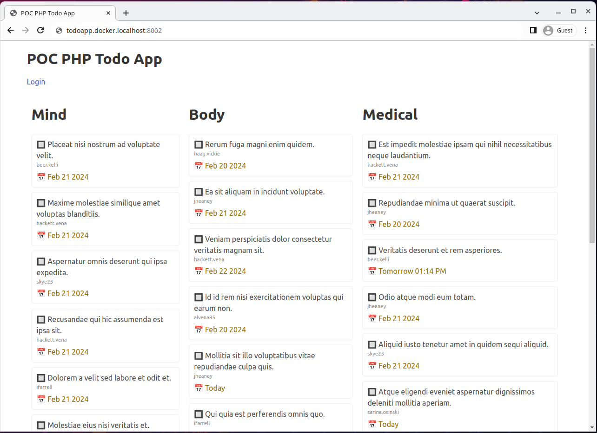
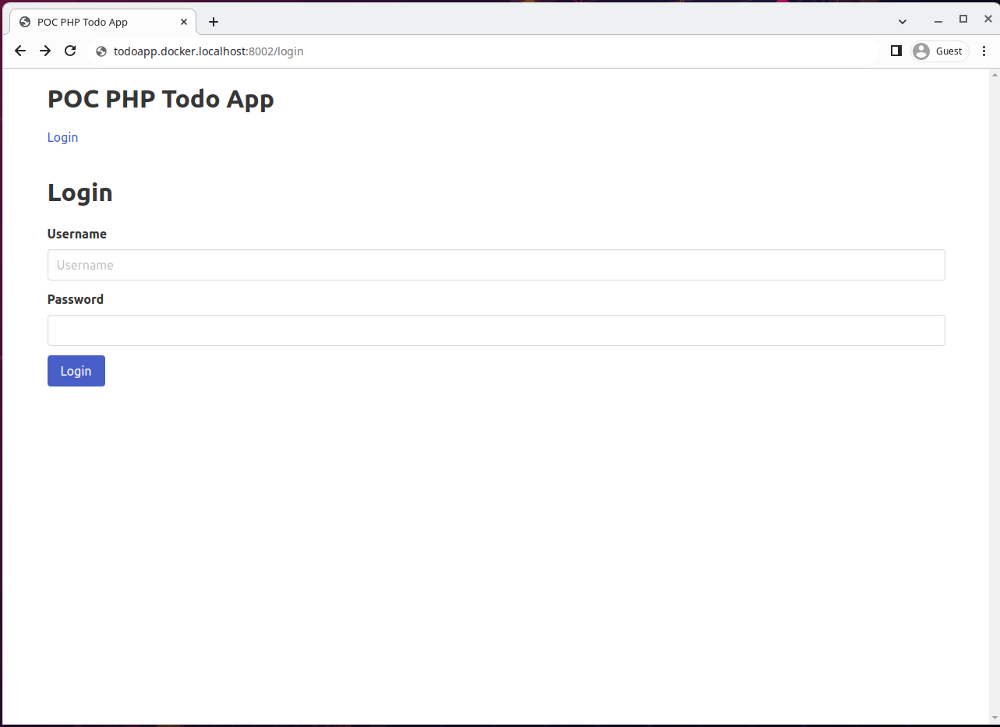
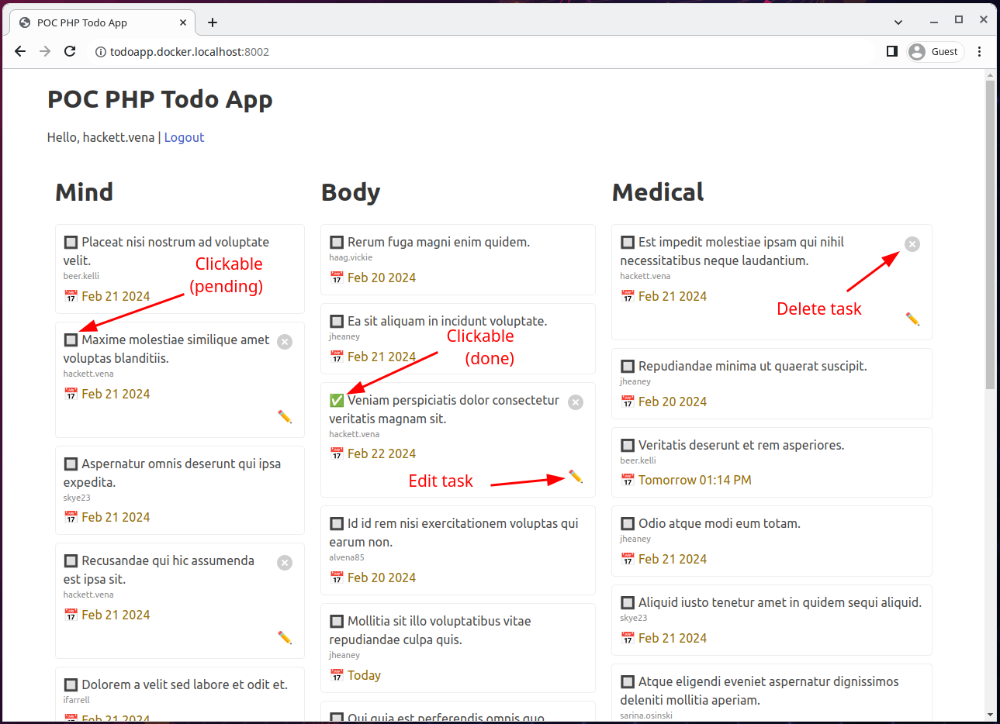
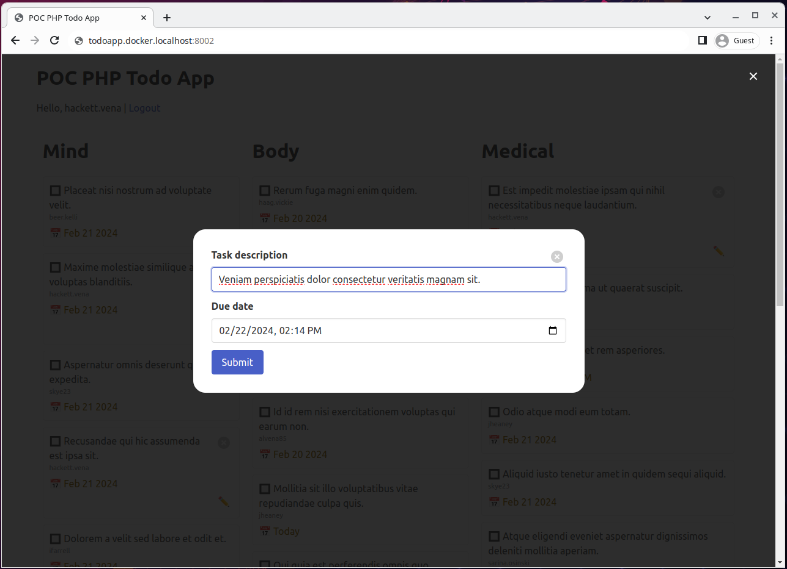

# POC vanilla PHP todo app for education purposes (teaching some basic PHP functionalities)

Nothing from here should be used in a production environment!

## Installation instructions

Assuming you are using Linux, and already have Docker installed.

Download Wodby's Docker4PHP from here: https://github.com/wodby/docker4php/releases

Unpack `docker4php.tar.gz` to a folder (eg. `todoapp` for the sake of these instructions)

In `todoapp/.env`, rename `PROJECT_NAME` and `PROJECT_BASE_URL` to something unique.

```
PROJECT_NAME=todoapp
PROJECT_BASE_URL=todoapp.docker.localhost
```

I have used Apache for development, so disable the Nginx part in `todoapp/docker-compose.yml`, and comment out the Apache part.

I am bootstrapping the application from its public folder, under the Apache configuration, set `APACHE_DOCUMENT_ROOT` to `/var/www/html/public/public`.

In case you need PHPMyAdmin to check the DB structure, comment out the PHPMyAdmin part in `todoapp/docker-compose.yml`.

Note that if you assume or know that you already use port `8000:80`, change it to something else under the traefik configuration in `todoapp/docker-compose.yml`.

Start up the container in root of the project (`todoapp/`).

```
todoapp $ docker-compose up -d
```

Once everything is set up without errors, clone or unpack the project to `public` subfolder (`todoapp/public/`).

Get into the container (from the root of the project, i.e. `todoapp/`).

```
todoapp $ docker-compose exec php sh
```

Inside the container,`cd` to the `public` folder.

```
wodby@php.container:/var/www/html $ cd public
```

Install the project with Composer.

```
wodby@php.container:/var/www/html/public $ composer install
```

Edit the database settings in the `.env` file in the root of the project. These are the default settings in Docker's `.env` file, so if you haven't changed them, they'll work fine in the project as well.

```
DB_DRIVER="mysql"
DB_HOST="mariadb"
DB_DATABASE="php"
DB_USER="php"
DB_PASSWORD="php"
```

Go to `todoapp.docker.localhost:PORT/install.php` and install the project. This will create a `users`, a `tasks` and a `users_tasks` table and feed the database with dummy data.

Alternatively, you could just import the `db_dump.sql` file from root to the database.

After this, you could visit `todoapp.docker.localhost:PORT` to see the project in action, and if you've enabled PHPMyAdmin, you could also open `pma.todoapp.docker.localhost:PORT` to see the database.

### Index page



### Login page

You could use any username which is in the database, all the passwords are `password`.



### Logged in

Once you are logged in you will be able to add, delete or edit the tickets which are related to the user. Also, you'll be able to change the status of the ticket by clicking on the checkbox infront of the task's title.

You could log out by clicking on the "Logout" link in the header.



### Submit or edit task

If you click on the "New task" link or the pencil icon, you'll be able to submit a new task or edit an existing one in a modal dialog.



## Technical info and extra details

### Requirements

- PHP 8.2
- MariaDB 10.9.5
- Composer 2

## Third party PHP libraries used

[Whoops](https://github.com/filp/whoops) - error handler framework.

[Illuminate](https://github.com/illuminate/database) - database toolkit.

[PhpRouter](https://github.com/miladrahimi/phprouter) - HTTP URL router.

[Faker](https://github.com/fzaninotto/Faker) - fake data generator.